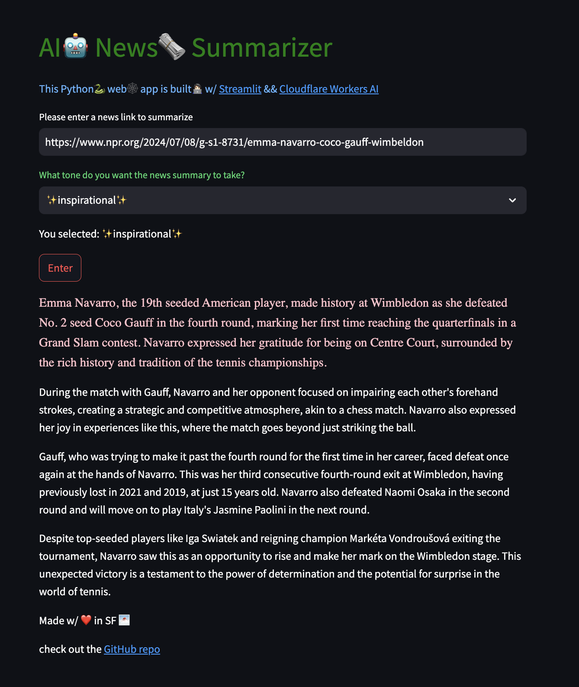

# AI News Summarizer with [Cloudflare Workers AI](https://ai.cloudflare.com/) and [public LoRAs](https://developers.cloudflare.com/workers-ai/fine-tunes/public-loras/)


Run fine-tuned inference with adapters trained with Low-Rank Adaptation for free.
This project uses the `mistral-7b-instruct-v0.1` fine-tune and `cf-public-cnn-summarization` LoRA adapter.

To run the app--
1. Install the necessary libraries with `pip install -r requirements.txt`.

2. Make a <em>.env</em> file with the following, replacing the Cloudflare API Token and Cloudflare Account ID with your own credentials from your Cloudflare dashboard Workers & Pages Overview:
```
CF_API_TOKEN=XXX
CF_ACCOUNT_ID=XXX
```
3. Run `streamlit run app.py` to run the app.
4. ✨tada🎉
